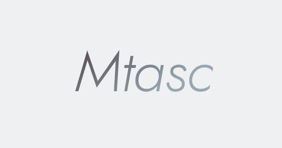

## MTASC - CLIENT - Frmework / ![C++ 20 <]

### 

<div style="flex-direction: row; gap: 5px; justify-content: center; margin: 5px;">
    <span>
         Asynchronous client framework, users build client libraries relying on lightweight POSIX-Socket,
          OpenSSL, and C++ Thread. Since it’s aimed at 'client' 
          development, Epoll/Iocp are not used and supports IPv4/IPv6.
           Welcome brothers to suggest RP, so the code becomes more stable !
          <hr>
    </span>
    </img>
</div>


###

###
## RP/EVENT

###

###
<div style="display:flex; flex-direction: column;">

<div>
    <table>
        <th>|DATA/TIME|</th>        
        <th>|EVENT/RP|</th>        
        <th>|CONTRIBUTOR|</th>
        <tr>
            <td>2026/6/22|12:26[CHINA]</td>
            <td>First time submitting to the repository</td>
            <td><a href="https://github.com/chromes-air">chromes-air</a>  
        </tr>
        <tr> <td>2026/6/24|1:04[CHINA]</td>
            <td>Changed ParserUrl parsing to use a state machine instead of brute-force parsing, fixed pointer errors in IPv6 parsing encapsulation, and renamed the CMake project to 'stagdeer-matsc' with support for 'async_read_until/async_read'.</td>
            <td><a href="https://github.com/chromes-air">chromes-air</a>
            </td>
        </tr>
        <tr> <td>2026/6/24|11:33[CHINA]</td>
            <td>Changed the error callback parameters for more consistent engineering, and renamed struct member variables so they no longer break the single responsibility principle.</td>
            <td><a href="https://github.com/chromes-air">chromes-air</a>
            </td>
        </tr>
    </table>
</div>

<hr>

###
## UPDATE

<div>
    <table>
        <th>UPDATE/TIME</th>
        <th>UPDATE/ERROR/FUNCTION</th>
        <th>UPDATE/FILE/LINE</th>
        <th>CONTRIBUTORS</th>
        <div>
            <tr>
                <td>2026/6/22|12:26[CHINA]</td>
                <td>Support for LINUX TCP connection/write/template generation/simple HTTPS/HTTP URL parsing will be supported tomorrow, and SSL handling will be organized after reading.</td>
                <td>TCP/socket_tcp.hpp</td>
                <td><a href="https://github.com/chromes-air">chromes-air</a></td>
            </tr>
            <tr>
                <td>2026/6/24|1:04[CHINA]</td>
                <td>Rewrote URLPARSER to use a state machine for parsing, supporting both query and normal URLs. Updated 'async_read_until/async_read' to implement basic TCP operations. Planning to handle 'Chunked' later, focusing on the 'Exml' project this week to support XML parsing, which will be helpful later. After next week, the main focus will be on implementing SSL connection reading.</td>
                <td>TCP/socket_tcp.hpp/Ipv4Addrs/Ipv6Addrs/Urlparser</td>
                <td><a href="https://github.com/chromes-air">chromes-air</a></td>
            </tr>
            <tr>
                <td>2026/6/24|11:31[CHINA]</td>
                <td>
                Refactored the low-level read logic, changing 'recv == 0' from being treated as a failure to a success since that's normal server behavior when there's no data to send. I also renamed 'client_addrs' to 'client_context' because it feels more straightforward and reasonable; 'addr' is for memory addresses, while 'context' means the context, so it fits the single-responsibility idea better. Plus, I changed the error callback notifications from 'int,string' to a unified 'std::error' type, making error info clearer and more professional. I tried parsing XML today—oh man, that's really tough—so I plan to first add 'SSL' support for Mtasc before diving into the XML parsing side of this project.
                </td>
                <td>TCP/socket_tcp.hpp/Ipv4Addrs/Ipv6Addrs/Urlparser</td>
                <td><a href="https://github.com/chromes-air">chromes-air</a></td>
            </tr>
        </div>
    </table>
</div>

##
## Next target

<span>
Supports 'OpenSSL' within a week, becoming a secure client framework
</span>

##

###

### It's not recommended to use it right now, but you can check out the code and submit a PR to make it more stable .

## EXAMPLE CODE (Complicated)

```cpp

#include "stagdeer/mtasc.hpp"
#include <cstddef>
#include <cstdio>
#include <memory>
#include <string>
#include <utility>


stagdeer::client::clientToolPtr tool_ptr = stagdeer::client::clientTool::newClientTool();

void doRead(struct stagdeer::client::socketTcp::client_context client_ctx , 
    stagdeer::client::socketTcpPtrT TcpPtr) {
        TcpPtr->async_read_until([TcpPtr](const std::error_code& ec , size_t accepet_bytes ,
             std::shared_ptr<stagdeer::client::readBuffer>&& result_buffer_ , 
                struct stagdeer::client::socketTcp::client_context&& ctx)
            {
                if (ec) {
                    printf("READ FAILED! %s\n" , ec.message().c_str());
                    return;
                }
                /**
                    Here you can parse HTTP/1.1, parse 'Content-Length',
                     and then tell 'async_read' how many bytes your body needs.
                */
                //READ FULL
                TcpPtr->async_read([](const std::error_code& ec, size_t accepet_bytes_ , 
                    std::shared_ptr<stagdeer::client::readBuffer>&& buffer ,
                        struct stagdeer::client::socketTcp::client_context&& _ctx){
                        if (ec) {
                            printf("READ FAILED: %s\n" , ec.message().c_str());
                            return;
                        }
                        /**
                        Here, you can parse a full HTTP response wrapped in your 'Response' 
                        class to become an HTTP client library.
                        */
                        printf("DATA:\n%s\n" , buffer->peekData());
                    return;
                }, std::move(result_buffer_) , std::move(ctx), 29506);
             }, std::move(client_ctx), "\r\n\r\n");
    return;
}

void doWrite(struct stagdeer::client::socketTcp::client_context client_ctx ,
    stagdeer::client::socketTcpPtrT TcpPtr , const std::string& url) {
        /**
          From now on, block template generation and URL parsing  
        */
        struct stagdeer::client::clientTool::client_parser_basic_url url_result = tool_ptr->syncParserBasicUri
        (url);
            std::string httpv1tmp = tool_ptr->syncCreateHttpv1template(url_result.addrs_host,
                url_result.addrs_path, "NULL", stagdeer::httpMethod::GET,
                {{"Content-type" , "text/html"}}) ;
        std::cout << httpv1tmp << std::endl; //Debug print template here
        /**
        RESULT:
            GET /json HTTP/1.1
            Host: httpbin.org
            Content-type: application/json
            Connection: close
        */
        TcpPtr->async_write([TcpPtr](const std::error_code& ec, size_t writed_bytes , 
            struct stagdeer::client::socketTcp::client_context&& ctx) mutable{
                if (ec) {
                    printf("WRITED FALIED: %s\n" , ec.message().c_str());
                    return;
                }
                
                printf("SUCCESS WRITE %zu BYTES\n" , writed_bytes);
                doRead(std::move(ctx), TcpPtr);
                return;
            }, 
        std::move(client_ctx), httpv1tmp);
    return;
}

void doConnect(struct stagdeer::client::socketTcp::client_context client_ctx , 
    stagdeer::client::socketTcpPtrT TcpPtr , const std::string& url) {
        TcpPtr->async_try_connect_tcp([TcpPtr , url](const std::error_code& ec , 
            struct stagdeer::client::socketTcp::client_context&& ctx){
                if (ec) {
                    printf("CONNECT FAIELD: %s\n" , ec.message().c_str());
                    return;
                }
                printf("CONNECT SUCCESS\n");
                doWrite(std::move(ctx), TcpPtr , url);
                return;
            }, std::move(client_ctx));
    return;
}

int main (int arg , char* argv[]) {
    if (arg < 3) {
        printf("ERROR: Paramter invalid!");
        return -1;
    }
    while (true) {
        std::string url = argv[1];
        std::string host  = argv[2];
        stagdeer::THREAD& threadInit = stagdeer::THREAD::getInstance();
        threadInit.createThreadManager(5);
        stagdeer::client::socketTcpPtrT TCP = std::make_shared<stagdeer::client::socketTcp>(host.c_str() , 80 , "NULL");
        struct stagdeer::client::socketTcp::client_context client_ctx = TCP->getClientContext();
        TCP->async_resolver_domain([TCP , url]
            (const std::error_code& ec , stagdeer::client::socketTcp::client_context&& ctx){
                if (ec) {
                    printf("RESOLVER FAILED: %s\n" , ec.message().c_str());
                    return;
                }
            printf("RESOLVER SUCCESS\n");
            stagdeer::THREAD& newThread = stagdeer::THREAD::getInstance();
                newThread.getThreadManager()
                .asyncTaskvoid(std::move(doConnect), std::move(ctx) ,TCP , url);
            printf("TRY CONNECT!\n");
            return;
        }, std::move(client_ctx));
    }
}

```
###
